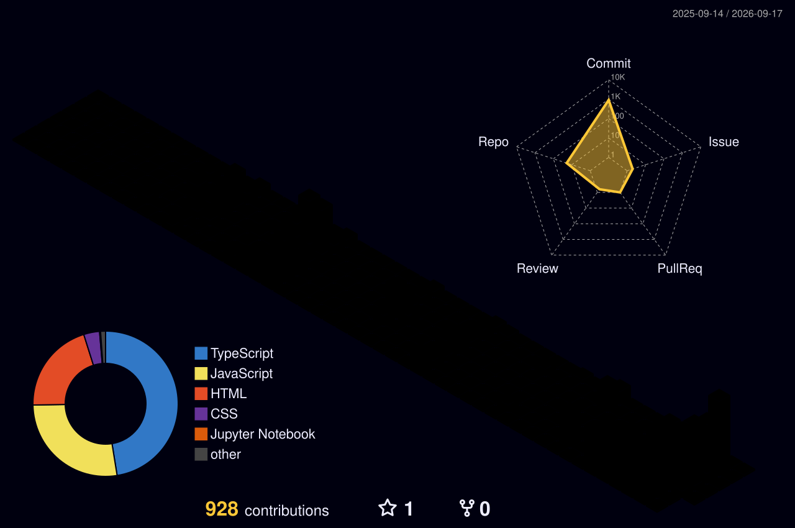

  
  
  
  

---

## About

Full-stack developer based in Istanbul, building web applications end to end — from typed API routes and Postgres schemas to 3D scenes and custom shaders in the browser.

- 🧩 I like problems that sit between **product polish** and **engineering depth** — smooth interactions on the surface, sound architecture underneath.
- 🎮 Recent work: real-time game logic with server-side answer verification, an interactive Solar System at true orbital scale, and a 500-butterfly GPU swarm that renders in **2 draw calls**.
- 🧠 Currently going deeper on **backend architecture, WebGL/GLSL, and real-time rendering performance**.
- 🌐 Everything I ship lives at **[tanertalas-portfolio.vercel.app](https://tanertalas-portfolio.vercel.app)**

---

## Tech Stack

**Frontend**

**Backend & Data**

**3D & Graphics**

**Tooling**

---

## Featured Projects

| Project | What it is | Stack |
| :--- | :--- | :--- |
| **[Logo Quiz](https://github.com/TanerTalas/Logo-Quiz)** · [Live](https://logo-quiz-lake.vercel.app) | Brand-recognition game — 365 logos, 10 categories, speed-based scoring. Answers verified server-side via signed cookies so the round can't be cheated. | Next.js · React · TypeScript · PostgreSQL · Drizzle |
| **[Solar System Journey](https://github.com/TanerTalas/Solar-System-Journey)** · [Live](https://solar-system-journey-plum.vercel.app) | Interactive 3D tour of the Solar System at true orbital spacing out to 30 AU, plus a raymarched black-hole shader with photon ring and lensing. | Next.js · React Three Fiber · TypeScript · NASA imagery |
| **[Butterfly Swarm](https://github.com/TanerTalas/Butterfly-Swarm)** · [Live](https://butterfly-garden-khaki.vercel.app) | A living sakura meadow you can release a named butterfly into — it flies for seven days, then it's gone. 500 butterflies in **2 draw calls**, 1.29 ms/frame on the CPU. | Next.js · Three.js · TypeScript · PostgreSQL |
| **[Flag Game](https://github.com/TanerTalas/Flag-Game)** | Full-stack "guess the country from its flag" game with a Node/Express backend. | React · Node.js · Express |
| **[Fire Eye](https://github.com/TanerTalas/fire-eye)** | A single eye of fire in the dark — custom GLSL shader work, zero build step. | Three.js · GLSL |
| **[Dragon](https://github.com/TanerTalas/dragon)** | A dragon that generates its own scales, roughness maps and wings procedurally in the browser. | Three.js · GLSL |

  More on <a href="https://github.com/TanerTalas?tab=repositories">my repositories</a> and in my <a href="https://tanertalas-portfolio.vercel.app">portfolio</a>.

---

## GitHub Stats

 

  

---

## Contribution Graph in 3D

 

---

### Let's build something

I'm open to full-stack roles, freelance work and collaborations.

**[tanertalas.dev@gmail.com](mailto:tanertalas.dev@gmail.com)** · **[Portfolio](https://tanertalas-portfolio.vercel.app)** · **[LinkedIn](https://www.linkedin.com/in/tanertalas/)**

